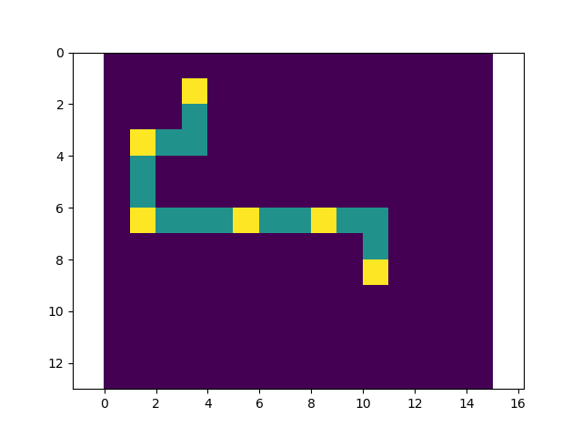

# Travelplanner (v0.1.0) 

Initial development release.

A python module to generate timetables, calculate routes, and much more.

## Installation and Usage

### Installation

Travelplanner can be installed by downloading the source directory and running `pip install .` in the root directory.

### Usage

The installation should allow you to begin using travelplanner right away provided you have a bus route and a passengers file.

```
bussimula {route_file} {passengers_file}
```

The route file and passenger files must be `.csv` files.

They should look as follows:

##### Route file
This would be saved as something like `route.csv`
```
1,1,A
1,2,
1,3,
2,3,
2,4,B
...
...
...
```

##### Passengers file
This would be saved as something like `passengers.csv`
```
1,1,2,2,25
0,0,3,4,15
2,2,2,6,25
...
...
...
```

We can then call the travelplanner as follows:
```
bussimula route.csv passengers.csv
```

### Command line options

bussimula has only a few options. You can see them by tunning `bussimula --help`.

```
usage: bussimula [-h] [--speed SPEED] [--saveplots] route_file passenger_file

Travelplanner command line inferface. Used to calculate journeys for
passengers on a bus route.

positional arguments:
  route_file      Route csv file name, for example "route.csv".Use path if
                  file not in current dirrectory.
  passenger_file  Passengers csv file name, for example "passengers.csv". Use
                  path if file not in current dirrectory.

optional arguments:
  -h, --help      show this help message and exit
  --speed SPEED   Accepts number indicating minutes per step.
  --saveplots     (OPTIONAL) Saves two plots of bus load and route in current
                  directory.
```

Using the `--saveplots` options saves two plots that look like the below in current directory.

Bus map - `map.png`           | Bus load - `load.png`
------------------------------|------------------------------
| 


### Python

This module can also be used as a package to import to your python projects.

```python
>>> import travelplanner as pl
>>> route = pl.Route('route.csv') #route.csv is in current working directory
>>> route
route((9, 6),(4, 6),10)
>>> 
```
or alternatively, you can import specific classes.
```python
>>> from travelplanner import Passenger, read_passengers
>>> passengers = [
...     Passenger(start=start, end=end, speed=speed)
...     for start, end, speed
...     in read_passengers('passengers.csv') #passengers.csv is in current directory
... ]
>>> passengers[:2]
[passenger1((1.0, 1.0),(8.0, 8.0),20.0), passenger2((1.0, 1.0),(5.0, 1.0),20.0)]
>>> 
```
We can import all Route, Journey, and Passenger classes for the following.
```python
>> from travelplanner import Passenger, Route, Journey
>>> john = Passenger(start=(0,2), end=(5,4), speed=20)
>>> mary = Passenger(start=(2,2), end=(6,4), speed=12)
>>> route = Route('route.csv')
>>> journey = Journey([mary, john], route)
>>> journey.travel_time(john.id)
{'walk': 68.28, 'bus': 70}
>>> journey.print_time_stats()
Average time on bus: 70 min
Average walking time: 56 min 
```

For a full list of methods with each of the classes, please see [html documnetation](html/travelplanner/), or use pydoc.

### Roadmap

In the future many features are planned.

* Currently, the package does not consider start time of bus route and passenger journey. Adding this feature will give the possibility to check whether a passenger will be quick enough to get to the required bus stop in time.
* Another bus route could be added so the passenger has an option of which bus to take.

### Contributing

Please see the [contributing documentation](CONTRIBUTING.md).

### Code of Conduct

We are following the [code of conduct](CODE_OF_CONDUCT.md) laid out by the [contributor covenant](https://www.contributor-covenant.org). 

### Authors and acknowledgement

Thank you to Dr David Pérez-Suárez, Dr Anastasis Georgoulas, and the rest of the MPHY0021 team who provided the base for this package. Thank you for being great teachers and making the project author enjoy the lectures. The author thinks that it was the best coding lecture course he has attended.

### Citation

Please use [CITATION.md](CITATION.md).


### License

See [License](LICENSE.md) file. 

### Project status

Currently the development of this project is being quality assessed. However we expect development to slow down. 
